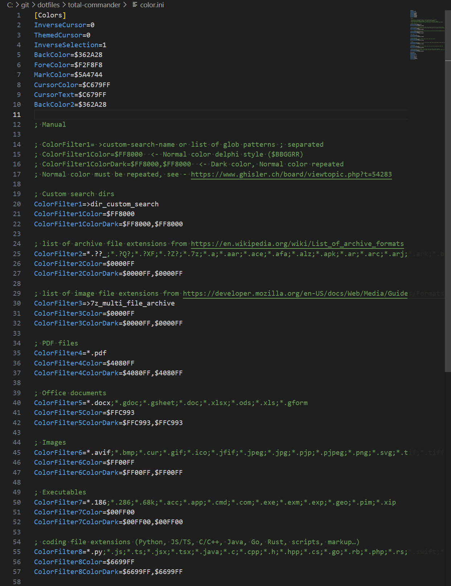
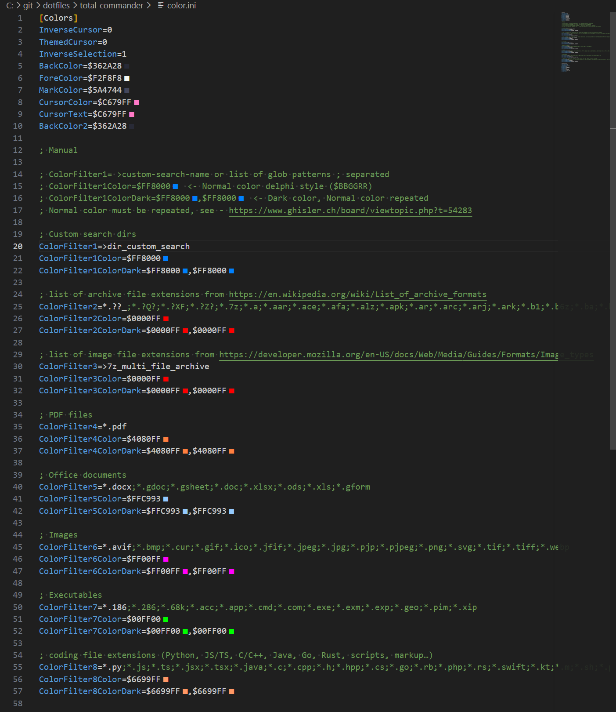

# vs-tc-color-show

vs code extension to show colors when editing .ini files for total commander.

## Screenshots

| Before | After |
| --- | --- |
|  |  |

## One time machine setup
```
npm install -g @vscode/vsce
```

## Publish a .vsix
```
vsce package
```

## Install extension
```
code --install-extension C:/git/vs-tc-color-show/vs-tc-color-show-0.0.2.vsix
```
